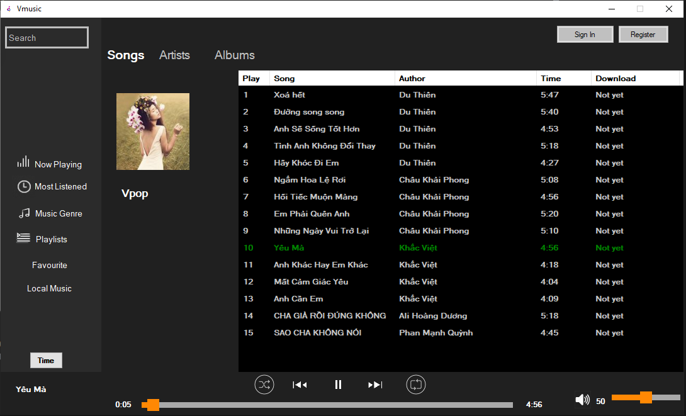
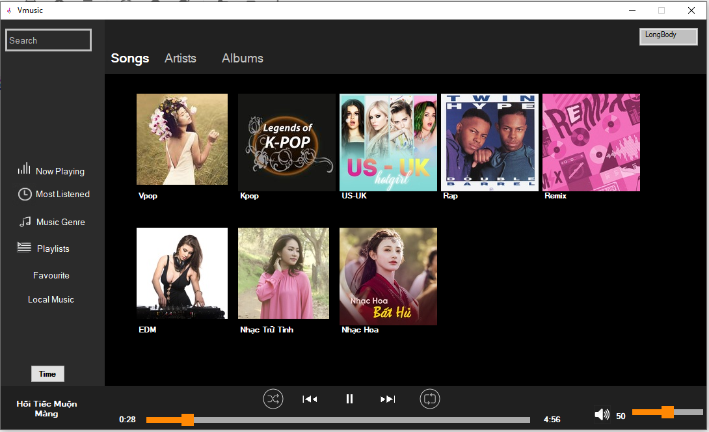
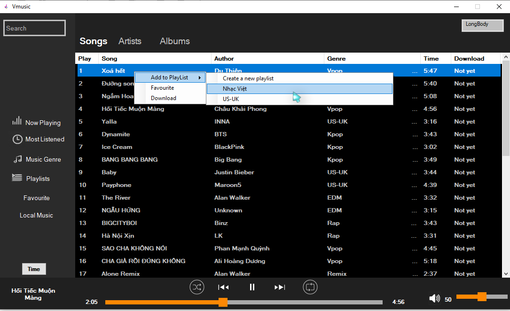
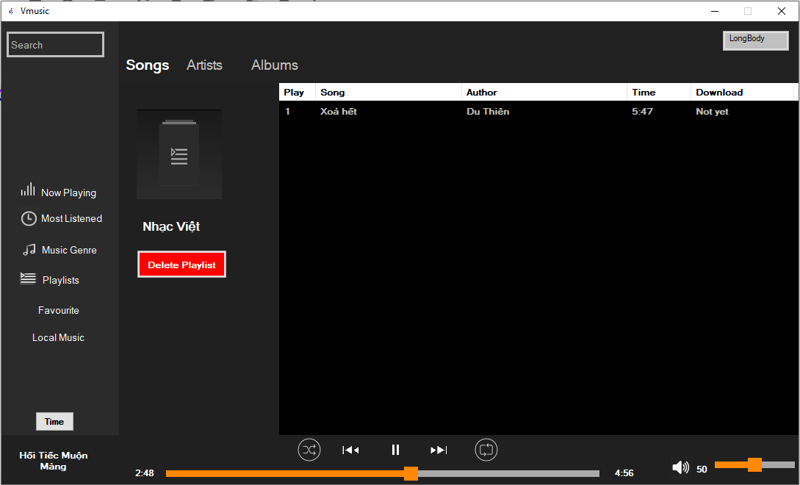
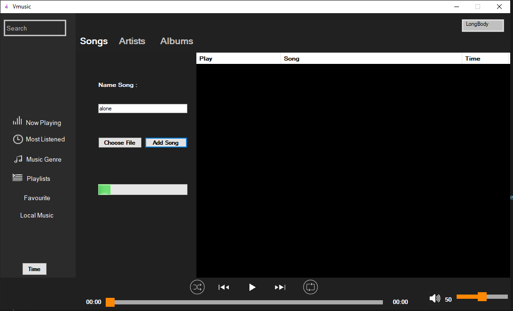

<strong>Vmusic  (Listen , download , upload songs )</strong>

<h2>Information</h2>
Tech : C# Winform (Three layer architecture) 
Database : SQL  

<h2>Installation</h2>

Download Vmusic project
 

Run SQL script
 

Open Vmusic.sln to use
 

<h2>Demo</h2>
 <a href="https://www.youtube.com/watch?v=SlESX-P5Gs8">Vmusic Demo</a> 

<h2>Examples</h2>

